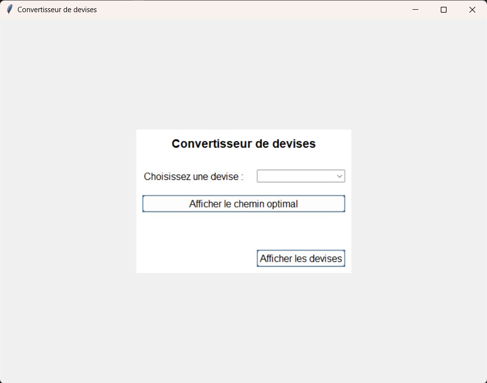
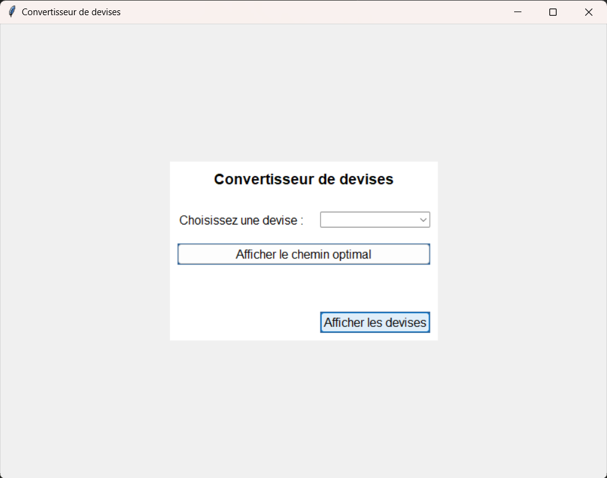
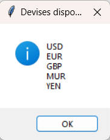
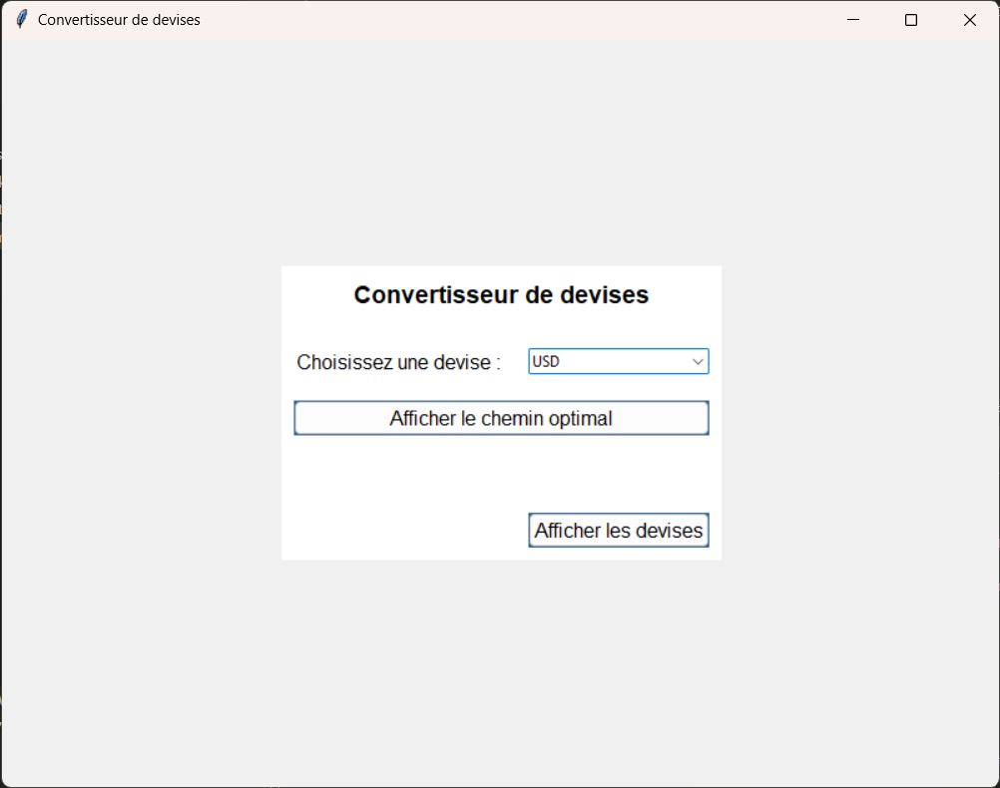
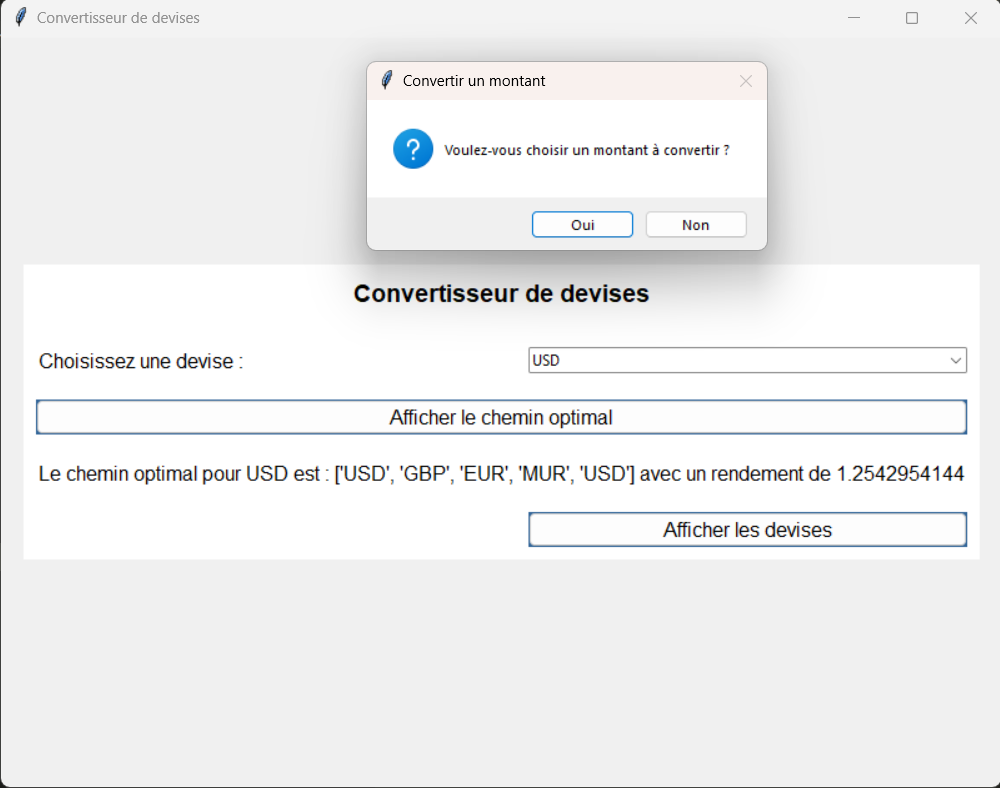
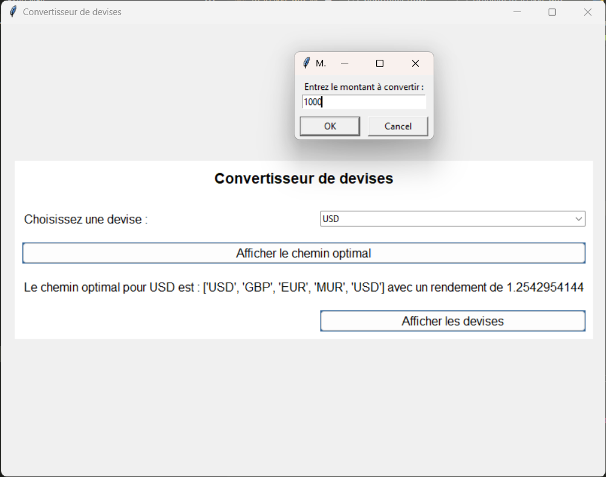
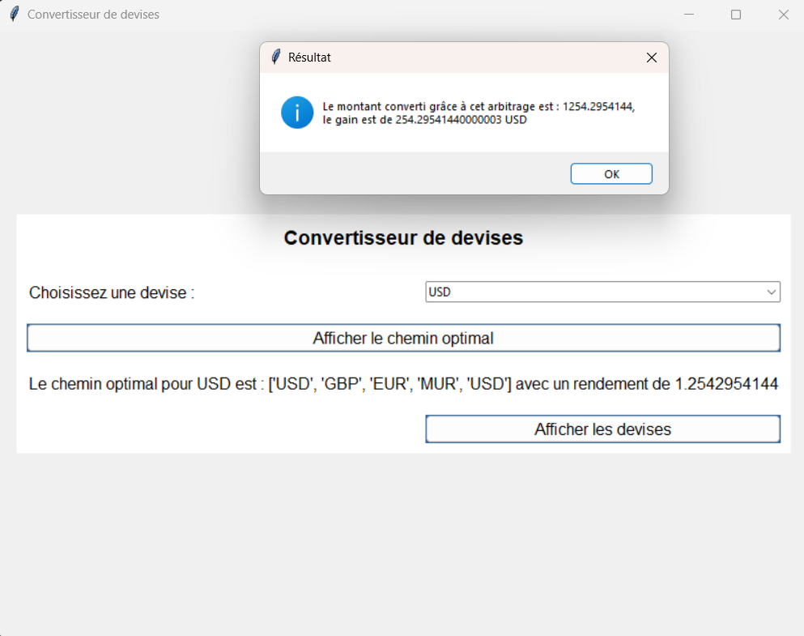

## Projet en Python pour répondre à cette problématique :

Un arbitrage consiste à utiliser les différences entre les taux de changes pour gagner de l'argent en une monnaie par une série de conversion.

Par exemple si on échange

1 euro contre 49 roupies
1 roupie contre 2 yen
1 yen contre 0.0107 euros
Le chemin total permet de convertir 1 euro en 1.0486 euros.

On suppose données n devises et une table n x n pour les taux de change.

Déterminer si des séquences d'arbitrage existent. Lesquelles rapportent le plus et lesquelles ont le moins d'étapes.

## Illustration du problème

Voici un graphe avec 3 devises et les chemins possibles de faire.

**Graphe :**

- il faut un chemin qui passe max une fois par une devise
- calculer tous les chemins possibles:
    - exemple : 3 sommets : A,B,C
        - A-A
        - A-B-A
        - A-B-C-A
        - A-C-A
        - A-C-B-A

        ```mermaid
        graph TD;
            A[EUR]-->D[EUR];
            A-->B[MUR];
            A-->C[YEN];
            B-->Y[EUR];
            B-->Z[YEN];
            C-->X[EUR];
            C-->W[MUR];
            Z-->U[EUR];
            W-->V[EUR]
        ```

Avec les chemins possibles pour effectuer un arbitrage, il nous faut un tableau de devise, pour pouvoir calculer quel est le chemin qui est optimal.

**tableau des devises :**

| Devise |  EUR  |  MUR  |  YEN  |
| :-----:|:-----:|:-----:|:-----:|
|  EUR   |   1   | 49.78 | 164.28|
|  MUR   |  0.02 |   1   |  3.31 |
|  YEN   | 0.0061|  0.3  |   1   |

**Les chemins :**

EUR -> EUR : Pas de transaction, donc aucun arbitrage.\
EUR -> MUR -> EUR : 1 EUR -> 49.78 MUR -> 1 / 49.78 EUR ≈ 0.02006 EUR (pas d'arbitrage).\
EUR -> YEN -> EUR : 1 EUR -> 164.28 YEN -> 1 / 164.28 EUR ≈ 0.00608 EUR (pas d'arbitrage).\
EUR -> MUR -> YEN -> EUR : 1 EUR -> 49.78 MUR -> 3.31 YEN -> 1 / 3.31 EUR ≈ 0.3022 EUR (arbitrage possible, gain de 0.3022 EUR).\
EUR -> YEN -> MUR -> EUR : 1 EUR -> 164.28 YEN -> 0.3 MUR -> 1 / 0.3 EUR ≈ 3.33 EUR (arbitrage possible, gain de 3.33 EUR).

Le meilleur chemin est : EUR -> YEN -> MUR -> EUR
  

## Comment faire marcher l'application via les lignes de commandes : 

1. Pour faire marcher l'application,il faut ouvrir le terminal et télécharger plusieurs package:

```
pip install poetry
pip install pyserde
pip install typer
pip install rich 
pip install tk
```

2. Utiliser poetry

Ouvrir un environnement virtuel :
```
poetry shell
```

Installer les packages nécéssaires au bon fonctionnement de l'application :
```
poetry install
```

Puis voir les commandes utilisables de l'application :

```
poetry run python -m dossier --help
```

Si tout fonctionne comme il faut, vous devriez avoir:
```
╭─ Options ─────────────────────────────────────────────────────────────────────────────────────────────────────────────────────────────────╮
│ --install-completion          Install completion for the current shell.                                                                   │
│ --show-completion             Show completion for the current shell, to copy it or customize the installation.                            │
│ --help                        Show this message and exit.                                                                                 │
╰───────────────────────────────────────────────────────────────────────────────────────────────────────────────────────────────────────────╯
╭─ Commands ────────────────────────────────────────────────────────────────────────────────────────────────────────────────────────────────╮
│ auteurs               Affiche les auteurs de cette magnifique application                                                                 │
│ convertir             Convertit un montant d'une devise source vers la devise cible                                                       │
│ devisee               Permet à l'utilisateur de choisir une devise et affiche le chemin optimal pour cette devise si il y a un arbitrage  │
│                       possible                                                                                                            │
│ devises-disponibles   Affiche les devises disponibles                                                                                     │
│ taux-de-change        Renvoie le taux de change entre deux devises choisies par l'utilisateur                                             │
╰───────────────────────────────────────────────────────────────────────────────────────────────────────────────────────────────────────────╯
```

3. Les différentes commandes :

- `auteurs ` :
```
poetry run python -m dossier auteurs
```

Le résultat attendu :

```
Auteurs :
- Raphael MERCIER
- Alexis SAVATON
```

- `devises-disponibles`: 
```
poetry run python -m dossier devises-disponibles
```

```
Devises disponibles :
USD
EUR
GBP
MUR
YEN
```

- `convertir`: 
```
poetry run python -m dossier convertir
```

```
Entrez la devise source : eur
Entrez la devise cible : mur
Entrez le montant (en EUR) à convertir en MUR : 1050
Montant converti en MUR : 51891.0
```

- `devisee`: 
```
poetry run python -m dossier devisee
```

Si vous voulez faire un arbitrage avec une devise :

```
Devises disponibles :
1. USD
2. EUR
3. GBP
4. MUR
5. YEN
Choisissez le numero de la devise : 5
Le chemin optimal pour YEN est : ['YEN', 'MUR', 'USD', 'GBP', 'EUR', 'YEN'] avec un rendement de 1.25084369088
Voulez-vous choisir un montant à convertir ? (o/n) : o
Entrez le montant à convertir : 1050
Le montant converti grâce à cet arbitrage est : 1313.385875424, le gain est de 263.385875424 YEN
```

Si vous ne voulez pas faire d'arbitrage :

```
Devises disponibles :
1. USD
2. EUR
3. GBP
4. MUR
5. YEN
Choisissez le numero de la devise : 4
Le chemin optimal pour MUR est : ['MUR', 'USD', 'GBP', 'EUR', 'MUR'] avec un rendement de 1.2542954144000003
Voulez-vous choisir un montant à convertir ? (o/n) : n
A+
```


- `taux-de-change`: 
```
poetry run python -m dossier taux-de-change
```

Le résultat attendu :

```
Entrez la devise source : yen
Entrez la devise cible : gbp
Taux de change entre YEN et GBP : 0.0052
```

## Comment faire marcher l'application via l'interface graphique :

Si ça n'a pas été fait précédement :

1. Pour faire marcher l'application, il faut ouvrir le terminal et télécharger plusieurs package:

```
pip install poetry
pip install pyserde
pip install typer
pip install rich 
pip install tk
```

2. Utiliser poetry

Ouvrir un environnement virtuel :
```
poetry shell
```

Installer les packages nécéssaires au bon fonctionnement de l'application :
```
poetry install
```

3. Maintenant pour ouvrir l'interface graphique :

``` 
poetry run python -m dossier.interface_graphique
```
Une fenêtre s'ouvre :



Afficher les devises disponibles : 



Un petit pop up qui apparait:



Appuyer sur OK, puis selectionnez la devise avec laquelle vous voulez faire de l'arbitrage:



Et appuyer sur "Afficher le chemin optimal"!

Sélectionner si vous voulez convertir : 



Si oui choisir le montant :



puis appuyez sur OK!

Vous avez maintenant le montant convertit et le gain!




Voila ! Vous avez votre arbitrage de fait !


